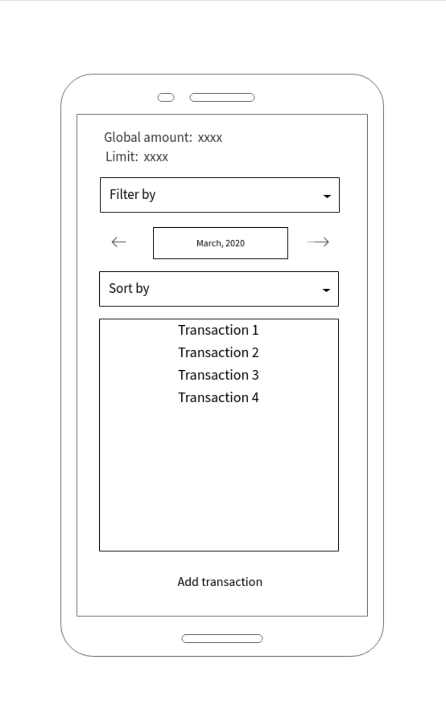
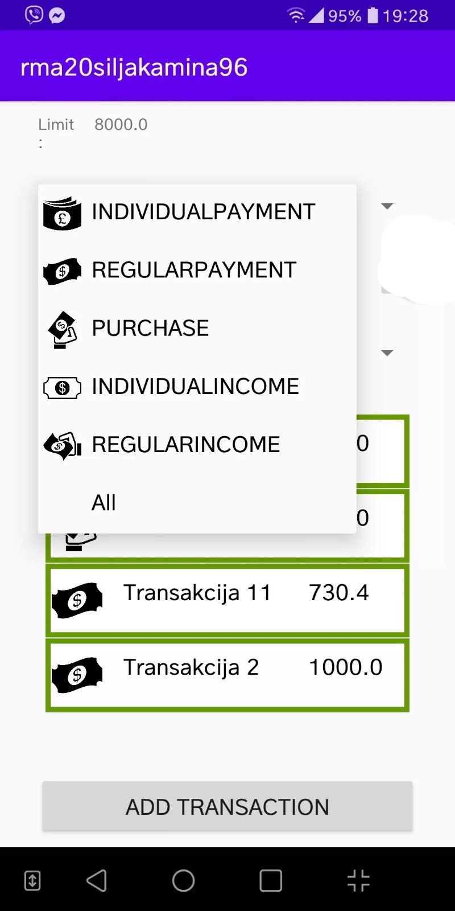
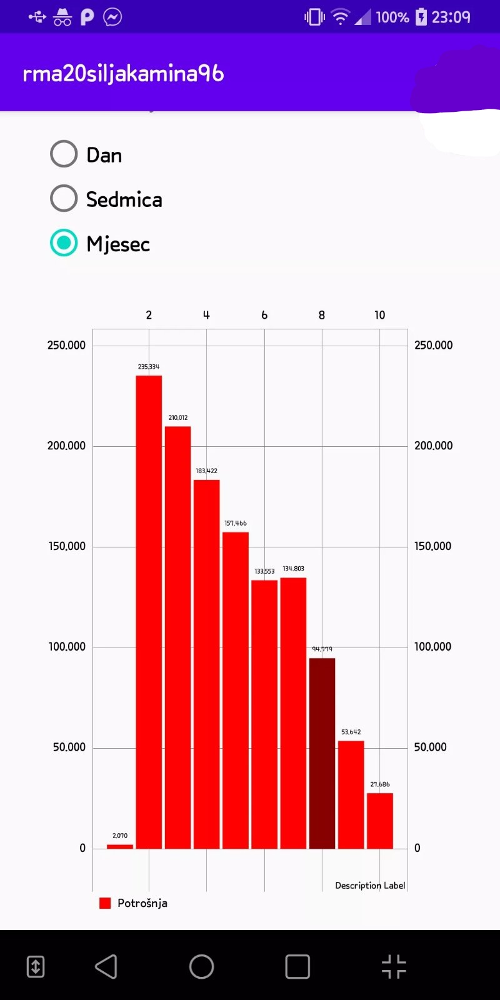

# Transactions manager

Android application which allows user to manage and keep track of his personal finances. 

### Application functionalities
If the phone is in landscape mode, the user switches between three different fragments by sliding left and right.  

The **first fragment**, the one that is being showed when the application is opened contains a list of all transactions, filtered by month, year and type of transaction. Transactions can be sorted by price, title or date. There are five types of transactions: *individual payment, regular payment, purchase, individual income and regular income*. Each of these types is different and has a different impact on overall budget. It is possible to show details of each transaction, edit or delete it, as well as add a new transaction. All fields of a new/edited transaction are being validated before saving.  

If the user is in online mode, application uses API for all listed operations, including filtering and sorting. If there is no internet connection, application goes to offline mode and saves changes to local database until the connection is established. 

The **second fragent** shows information about users account: *his budget, his total limit and his month limit*. If the user goes over the limit when adding a transaction, a warning shows. These information can be edited.  

The **third fragment** shows graphically represented statistics for transactions. There are three types of graphs: *spendings graph, earnings graph, and graph thats showing overall state*. The user chooses if he wants the graphs to show data *by day, week or month*. This was implemented using MPAndroidChart library.  

If the application is being used in landscape mode, a fragment for editing a chosen transaction/adding a new one is showed alongside the fragment showing a list.  

   
   
   

This application was made for the purpose of lerning on Mobile Application Development course on my faculty. The API that it uses and that was created for this course is no longer available.  

### Built using
[][java]
[][javafx]
[][SQLite]
[][jasperreports]

[java]: https://www.java.com/en/
[SQLite]: https://www.sqlite.org/index.html
[javafx]: https://openjfx.io/
[jasperreports]: https://community.jaspersoft.com/

